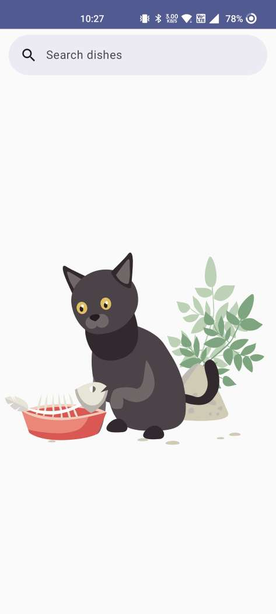
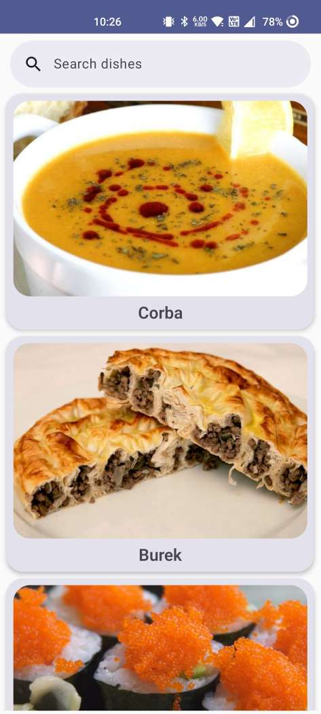
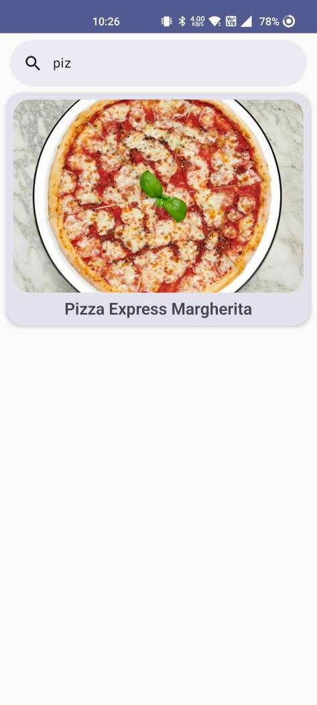
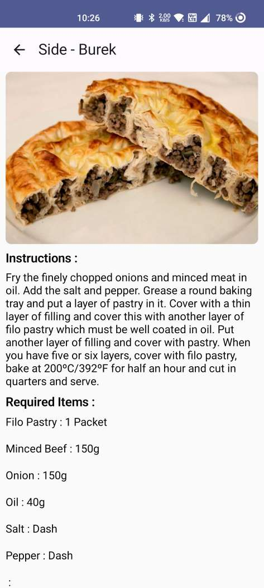

# Clean Architecture Sample App with Jetpack Compose

This is a sample Android app that demonstrates the implementation of Clean Architecture using 
Jetpack Compose for the user interface and [TheMealDb](https://www.themealdb.com/) API for fetching
dishes data. The app allows users to search for dishes and view their details, including the list of
ingredients.

## Features

- Search for dishes: Users can search for dishes by entering keywords.
- View dish details: Users can tap on a dish to view its details, including the list of ingredients.

## Screenshots

|                                                                     |                                                                     |                                                                      |
|---------------------------------------------------------------------|---------------------------------------------------------------------|----------------------------------------------------------------------|
|  |  |  |
|  |

## Architecture

The app is structured following the principles of Clean Architecture, which promotes separation of 
concerns and maintainability by dividing the app into distinct layers:

1. **Presentation Layer (Jetpack Compose):**
    - Contains the UI components and handles user interactions.
    - Uses Jetpack Compose for building the UI.

2. **Domain Layer:**
    - Contains the business logic and use case definitions.
    - Defines data models and use case interactions.

3. **Data Layer:**
    - Handles data access and retrieval from external sources (TheMealDB API).
    - Implements a repository interface for fetching data.

4. **Dependency Injection (DI):**
    - Utilizes Hilt/Dagger for managing dependencies.
    - Provides instances of ViewModel, Use Cases, and Repository using DI.

## Tech Stack

- Kotlin
- Jetpack Compose
- Hilt/Dagger (Dependency Injection)
- Retrofit (Networking)
- Gson (JSON parsing)

## Build for testing

<a href="/apk/CleanArchitectureMealApp.apk" title="Download" download>Download</a>

## Contributions

Contributions to this project are welcome! If you find any issues or want to add new features, feel 
free to submit a pull request.